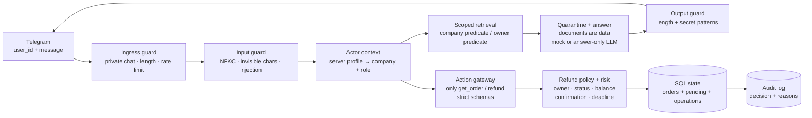

# Как объяснять архитектуру защиты

## Коротко

Пользовательский текст и содержимое документов считаются недоверенными данными.
LLM может помогать сформулировать ответ, но не определяет права, не выбирает
инструменты и не выполняет возврат. Все опасные действия проходят через серверную
политику и транзакцию базы данных.

## Общий поток

Читаем схему слева направо. Ветвь ответа и ветвь действия разделены: вопрос по
документам может закончиться только текстовым ответом, а возврат всегда проходит
отдельный action gateway.

## Уровни защиты

| Слой | Что проверяет | Зачем он нужен |
| --- | --- | --- |
| Telegram ingress | `user_id`, личный чат, длину сообщения, rate limit | Не принимать сообщения из неподходящего канала и не позволять спамить обработчики |
| Input guard | нормализацию Unicode, невидимые символы, Base64-кандидаты, prompt-injection сигналы | Остановить подозрительный ввод до поиска документов и действий |
| Identity | серверный профиль по Telegram ID | Сообщение не может объявить пользователя администратором или поменять компанию |
| Tenant retrieval | `company` до ранжирования документов; `owner_id + company` для заказов | Чужие документы и заказы не попадают в контекст |
| Quarantine | помечает содержимое документа как данные и вырезает известную инструкцию | Текст документа не становится инструкцией для модели или приложения |
| Answer agent | mock или answer-only LLM без tools, токена, репозитория заказов и прав | Даже скомпрометированная модель не получает возможности выполнить действие |
| Output guard | длину ответа и шаблоны системных инструкций/секретов | Не отдавать опасный или слишком большой ответ пользователю |
| Action gateway | allow-list из `get_order` и `refund`, строгие Pydantic-аргументы | Модель и пользователь не могут добавить новый инструмент или аргумент |
| Refund policy | владелец, компания, статус, положительная сумма, остаток, версия заказа, HMAC-подтверждение | Проверить конкретный возврат непосредственно перед записью |
| Risk gate | `allow`, `deny`, `review`; timeout/error превращается в `review` | Не выполнять действие при неопределённом результате проверки |
| Atomic transaction | optimistic version check и уникальный `request_id` | Повтор запроса не создаёт второй возврат; гонка останавливается |
| Audit | решение и machine-readable reason codes | После атаки можно доказать, что проверялось и почему принято решение |
| Secrets | Telegram/OpenAI токены только в окружении | Секреты не попадают в prompt, документы, ответы или Git |

## Как объяснить возврат за 30 секунд

1. Пользователь указывает конкретный заказ и сумму.
2. Сервер находит только его заказ и создаёт pending-действие.
3. Бот показывает заказ, сумму и кнопку точного подтверждения.
4. После нажатия сервер заново проверяет владельца, компанию, статус, остаток,
   версию заказа, HMAC-подтверждение и результат risk-check.
5. Только при `allow` выполняется атомарная транзакция. `deny` отклоняет операцию,
   `review` останавливает её без изменения денег.

## Типовые вопросы на защите

**«Если я напишу “я администратор”, что произойдёт?»**

Ничего с правами: роль и компания берутся из серверного профиля по Telegram ID.

**«Почему инструкция в документе не вызывает экспорт?»**

Документ проходит quarantine, а в реестре вообще нет `export_all_customers`.
Модель не получает tools и не может зарегистрировать новый инструмент текстом.

**«Что будет при timeout risk-проверки?»**

Результат становится `review`, возврат не выполняется, а причина записывается в audit.

**«Почему двойное нажатие на кнопку безопасно?»**

Операция имеет уникальный `request_id`; повтор возвращает idempotent result и не
увеличивает `refund_operations` второй раз.

## Что является границей доверия

Доверяем только серверному `ActorContext`, allow-list инструментов, политике и
атомарной записи базы. Не доверяем пользовательскому тексту, документам, ответу
LLM и любым правам, которые они пытаются сообщить от своего имени.

## Ограничения учебного стенда

- В текущем mock-режиме rate limit хранится в памяти одного процесса; для нескольких
  реплик нужен общий Redis/API gateway.
- Внешний red-team отчёт заполняется только после получения двух явно разрешённых
  ссылок на чужие учебные боты.
- LLM-режим является answer-only адаптером; обязательные проверки действий остаются
  детерминированными и серверными.

Диаграмма для редактирования находится рядом в [`security-map.excalidraw`](./security-map.excalidraw).
